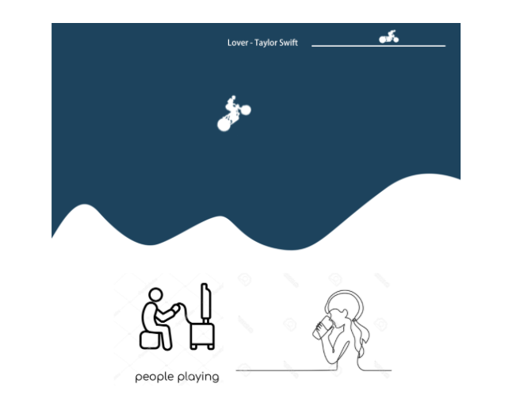
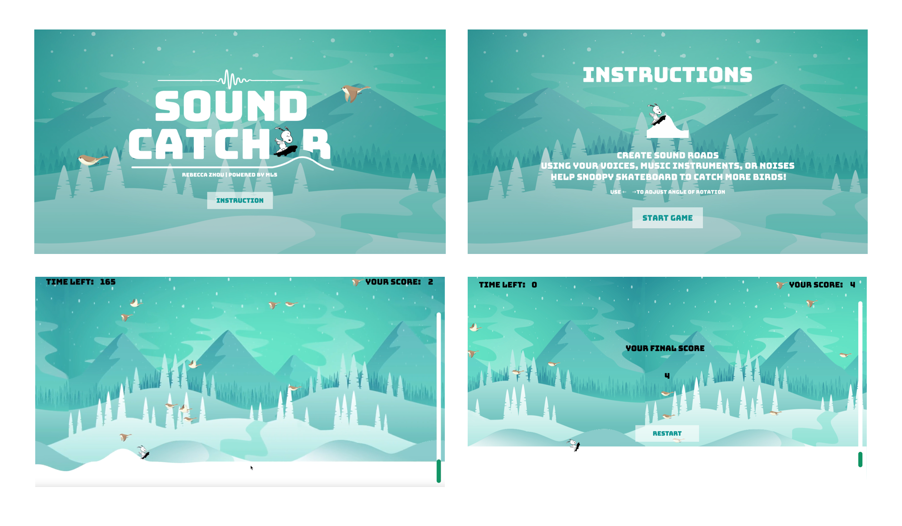
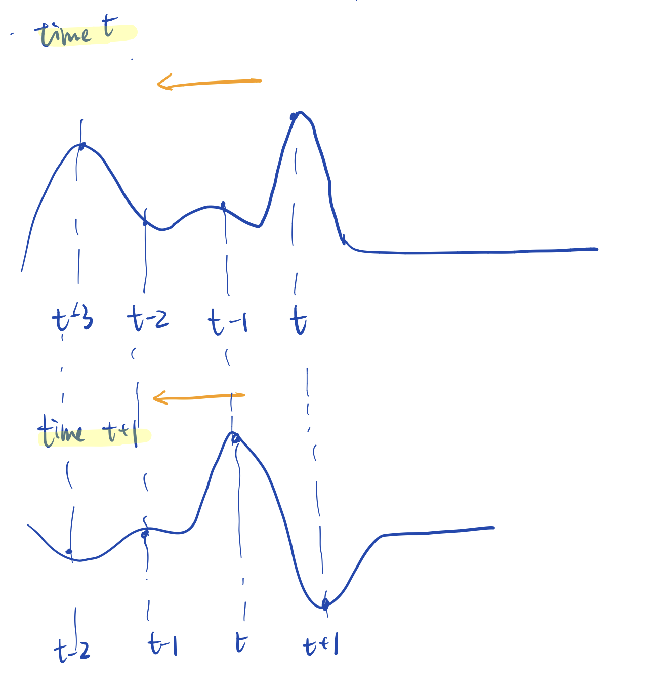

# SoundCatcher

Play a revised motorcycle game using your voices. Sing melodies to generate waves so as to help our Snoopy to catch birds. Try it out in this [Live Website](https://rebeccazhou666-final-dwd.glitch.me/). Also you can see video demo below.

This project is featured by [ml5.js community](https://ml5js.org/community). Empowered by [CREPE Model](github.com/marl/crepe) and [ml5.js](https://ml5js.org/).  

# About
Motorcycle games are one of the classic web games. By simply using arrow keys and space bar to control the motorcycle to ride over the rough roads. Inspired and developed on that, SoundCatcher goes way beyond by creatively changing the way of playing and natually using the up-to-date machine learning model. Users now control the movements of the character by singing melodies to generate "waves"/roads underneath and help the character to catch more awards.  
<strong>Type: </strong> Single-player game.
  

# Prerequisites & Installation
Clone or Download this repo to run the project.  

# Design Question
Machine Learning is evolving rapidly and changing people's lives drastically. Yet general public are still unfamiliar with this emerging tech and some are worried about its impact. Therefore, it's a good way to convince the public and raise their interest in Machine Learning by gamifying them. <strong>So the question is, how to create fun things that naturally blends machine learning in?</strong>

# Design Process
<h3>Ideation</h3>
People are always enthusiastic about games. So I started looking for classic fun games that were suitable for machine learning elements to blend in. I found that the classic motorcycle game and the pitch detection model (CREPE model) were a perfect match. The road in motorcycle game could be also interpreted as waves, which was highly similar with the human voices. So I decided to use this pair to create an interesting game.  

<h3>Prototype 1</h3>
Core Idea: Generating roads by uploading songs so that users can control the motorcycle as the melody goes.  

<strong>Technical feasibility testing</strong>

CREPE is trained on 16 kHz audio WAV, so the uploaded songs has to be resampled first to 16 kHz and has to be WAV file. I tried the
`resampy` in Python on my localserver and it turned great output. But things didn't work out as I changed the method in Javascript using  [resampler.js](https://github.com/taisel/XAudioJS/blob/master/resampler.js) in [XAudioJS](https://github.com/taisel/XAudioJS).  
In this idea, the song need to be changed in the following steps:
1. Change to WAV format if it's not.
2. Resampled to 16kHz
3. Processed by `CREPE` model using tensorflow.js
4. Send arrays back to Javascript.
 
When I finished the first two steps, I surprisingly found that a 2-min song required more than 3 min to change format and resample, not along the other steps. Considering the technical feasibility, I gave up this idea since it was not doable as a one-week project. 

<h3>Prototype 2</h3>
Core Idea: 2-player Game. Player 1 Generates roads by singing while Player 2 controls motorcycle in the generated road.  

<strong>Technical feasibility testing</strong> 

I received valuable feedback from Atharva and Cara who suggested me to change it to a 2-player game. It helped me to think in a different way and I landed on this idea. 

It was way much easier as [ml5.js](https://learn.ml5js.org/docs/#/reference/pitch-detection?id=pitchdetection) simplifies the CREPE model and provides the real-time pitches as I need. So the process changes to the following:
1. Detect pitches of player 1 using microphone.
2. Render waves in Javascript
 
I quickly made a demo and proved the feasibility of this idea. However, the way of playing troubled me. In this 2-player game, what's the relationship of players? Did they need to compete with each other or collaborate? Which way of playing was better for BOTHs experience? How to set the feedback so as to make two players feel motivated?  

As you can imagine, the <strong>level design </strong> was extremely hard for this prototype. The player 1 was easy to manipulate a difficult level which would upset the player 2 who controlled the motorcycle, or made it too easy to let player 2 go through. There was a super fragile balance between 2 players.  

I used the demo of prototype 2 to test several pairs and the vibe was a little bit awkward during the game. Players were not knowing how to collaborate or compete and they were reported not having fun in the game. So I decided to change a path to make the game experience better. 

<h3>Prototype 3</h3>
Core Idea: single-player Game. Player 1 Generates roads while the road itself decides the height of motorcycle.  

I consulted Roi, a 6-year game producer, about the game design. She gave lots of useful advice, including changing back to single-player game, adding feedbacks, etc. It occurred to me that I can control the road instead of the motorcycle to make it a single-player game. I tried it and it worked very well. So I followed this prototype, better the storytelling by creating a good visual design and a new character to replace the motorcycle. 

I decided to tell a snowboarding story since the roads generated by voices were more like snow lands. Snoopy, our character, was snowboarding on the ice land and try to catch birds by the supports of the waves generated by your voices. 

# Development Details
<h3>Tips of Machine Learning Develepment for Web</h3>

I used an array to store the pitches of voice detected every frame and rendered them as waves. One assumption behind was that the refreshing rate was constant so that the waves move back in a constant speed as well.

The reality was that, treal-time rendering of "waves" caused CPU so that the refreshing rate of the browser will vary from time to time. To stablize it, I tested the framerate and set the framerate below the lowest of the framerate that machine learning model can slow down.
~~~
// framerate setup beforehead
function setup(){
  frameRate(30);
}
~~~

# Future Plan
- Using node.js to store the scores of users to make a ranking list.
- Generate the position of birds according to the pitches of certain song so that people can catch more bird when they sing a certain melody, like “bad guy”.
- Try to develop a function that can recognize pitches of uploaded sound files instead of microphone (back to prototype 1).

# Reference & Credits
* [CREPE Model](github.com/marl/crepe)
* [ml5.js](https://ml5js.org/)

## Built with

* [VS Code](https://code.visualstudio.com/)
* [Github](https://github.com)

## Author

* [Rebecca Zhou](https://rebeccazhou.net) 
